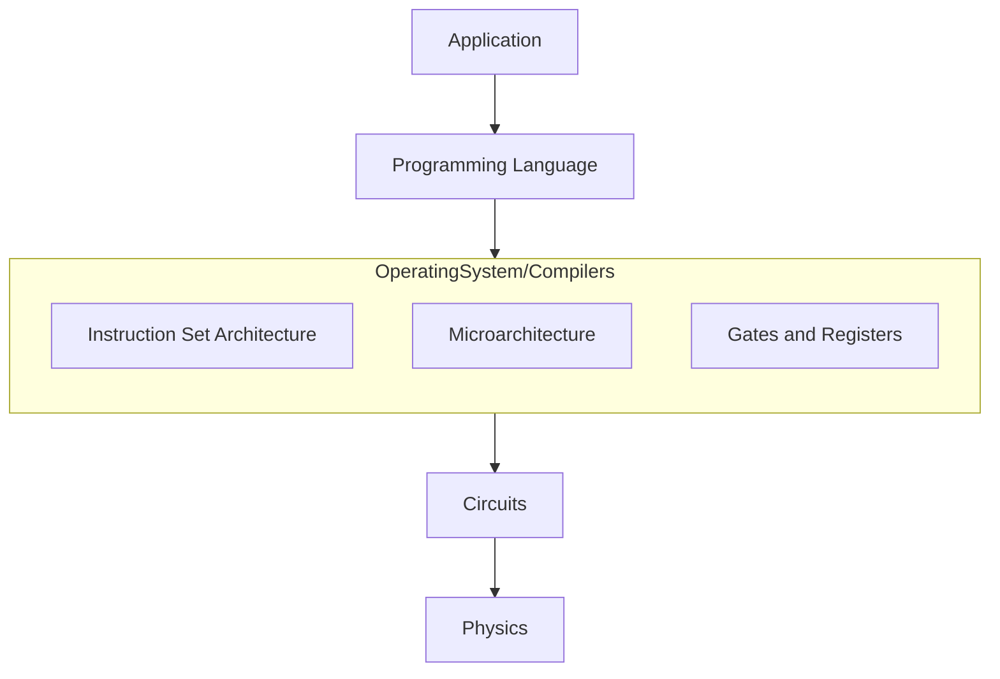

# Lecture - Introduction to Computer Architecture
Created on: 10-17-2022 20:27
___

### abstraction layers in modern systems

```mermaid
flowchart TB
	Application-->PL[Programming Language]

	subgraph OperatingSystem/Compilers
		direction TB
		ISA[Instruction Set Architecture]
		M[Microarchitecture]
		REG[Gates and Registers]
	end

	PL-->OperatingSystem/Compilers
	OperatingSystem/Compilers-->CIR[Circuits]
	CIR-->PHY[Physics]
```

