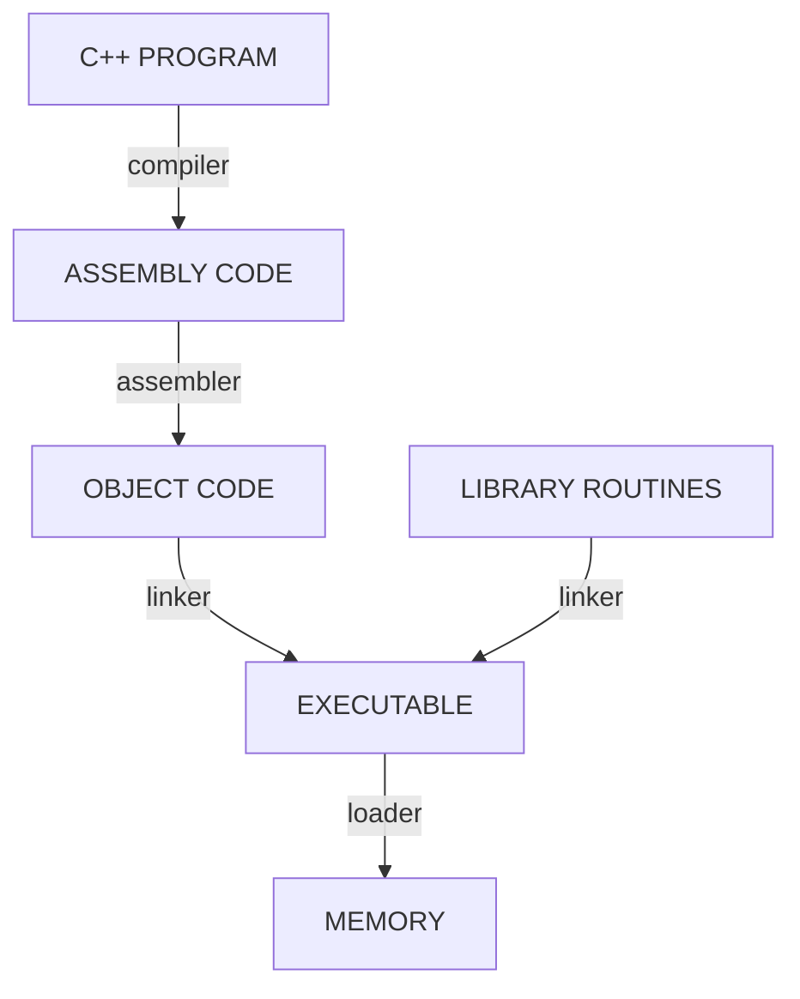

# Ch2 -- Lecture Supplemental - Instruction Set Architecture (ISA)
Created on: 09-04-2022 14:19
___

objectives:
	understand differences between types of ISAs
	- ISA vs assembly lang. vs processor
	- accumulator, stack, von Neumann, GPR (and how they work)
	- companies that make CPUs: Intel, AMD, ARM, IBM, Qualcomm
	- types of ISA isntructions (ex: load, store, ALU, branch)
	- be able to understand MIPS and map them to the 4 instruction types
	- be familiar with basic microarchitectural components
			- registers
			- PC
			- ALU
			- control unit

### Instruction Set Architecture (ISA)
contract bewtween programmer and hardware
	- defines **set of instructions** that can execute on the processor
	- defines visible **state** of the system
	- defines how **state changes** in response to instruction execution

for compiler writers:
	ISA is a model of how a program will execute

for hardware designer:
	ISA is formal definition of the correct way to execute a program

[Basic Rundown of ISA](http://www.cs.kent.edu/~durand/CS0/Notes/Chapter05/isa.html)

**ISA Classification**
classified by:
	- computation model
			- **GPR** (general purpose register): all operands are explicitely mentioned and are either registers or memory location
			- **stack**: the operands are implicitly on top of the stack
			- **accumulator**: one operand is implicitly the accumulator
	- design principle
			- reduced instruction set code (**RISC**)
			- complex instruction set code (**CISC**)
	- processor generation or model

von Neumann architecture is based on stored-program computer concept 
	see [[Ch2 - Instructions#^b61cbc]]

GPR
	pro:  makes code generation easy. data can be stored for long periods in registers
	cons: all operands must be named causing longer instructions
Most CPUs nowadays are GPR because registers are faster than memory and easier to use

Reduced instruction set code (RISC)
	- that all instructions are exactly the same size
	- (reduced because # of bits for opcodes are reduced)
	- also called load/store architectures

![[cs3339_lec2_img1.png]]

special registers:
	- PC: program counter / instruction pointer
	- SP: stack pointer, top of stack
	- FP: frame pointer, bottom of stack (typically)
	- ZERO (for MIPS)

ALUs
	- built from logic gates
	- fairly cheap

instruction classification
	- ALU operations (arithmetic and logic)
	- data movement (memory: store, load, move)
	- control flow (branch (conditional vs unconditional))

assembly vs machine lang.
assembly | machine
-- | --
human-readable | machine-readable
associated with an architecture | tied to specific hardware
ex: x86 assembly | machine code for Ryzen

C++ code translation hierarchy ^cbe0d9

